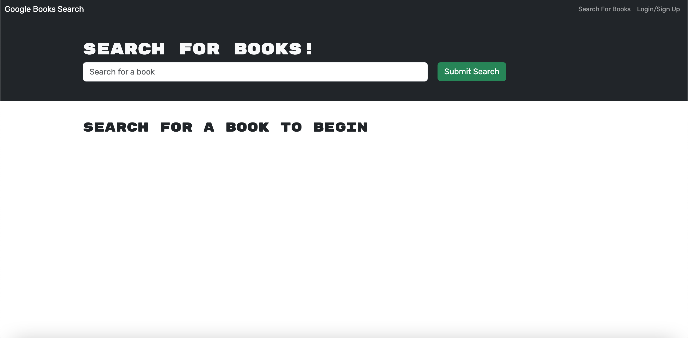
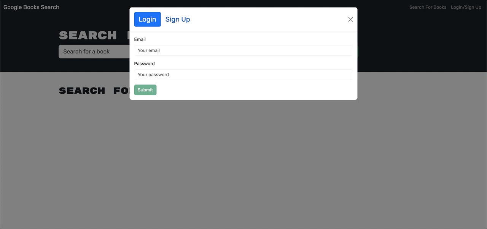
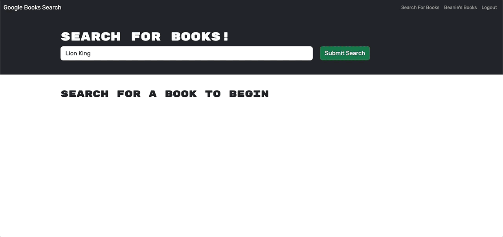
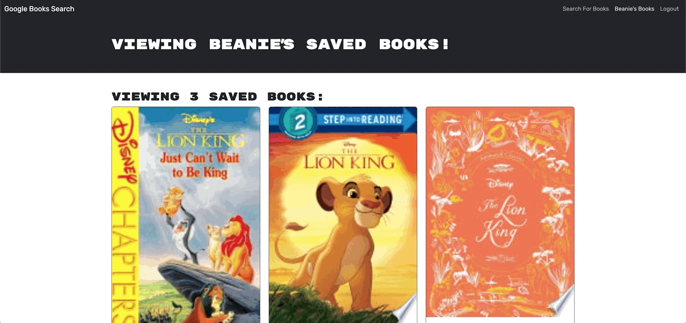

# Book-Search-Engine


## Table of Contents

- [Technologies Used](#technologies-used)
- [Description](#description)
- [Installation](#installation)
- [Usage](#usage)
- [Screenshots](#screenshots)
- [License](#license)
- [Questions](#questions)

## Technologies Used

### Frontend:

    -   React
    -   Apollo Client
    -   GraphQL

### Backend:

    -   Node.js
    -   Express.js
    -   MongoDB with Mongoose
    -   Apollo Server
    -   GraphQL
    -   JWT Authentication

## Description

The MERN Book Search Engine is a full-stack application that allows users to search for books using the Google Books API and save their favorite books to their profile. This project is refactored from a RESTful API to a GraphQL API using Apollo Server. The application is built with MongoDB, Express, React, Node.js, and utilizes JWT-based authentication for secure login and book-saving functionality.

## Installation

1. Clone the repository:
   ```
   git clone https://github.com/yourusername/book-search-engine.git
   cd book-search-engine
   ```

2. Install dependencies for both client and server:
    ```
    npm install
    ```

3. Set up environment variables:

    -   In the server directory, create a .env file and add the following variables:
    ```
    MONGODB_URI='your_mongodb_connection_string'
    JWT_SECRET='your_jwt_secret_key'
    ```

4. Run the application:

    -   Run the server and client in development mode:
    ```
    npm run develop
    ```

The application should now be running on http://localhost:3000.

## Usage

1. Create an account or log in using existing credentials.
2. Search for books using the search bar powered by the Google Books API.
3. View search results, each featuring a book’s title, author, description, image, and a button to save a book to your account.
4. Access your saved books by clicking on option to see your books.
5. Click on the Remove button on a book to delete a book from your saved books list.
6. Click on the Logout button to be logged out of the site and you are presented with a menu with the options Search for Books and Login/Signup and an input field to search for books and a submit button.

## Screenshots

The following screenshot shows how the home page appears:



The following animation shows the Login/Signup model:



The following animation shows the logged in user can save the searched books to their account:



The following animation shows user's saved books and functionality of delete button to remove a book:



Link to the deployed site:

https://book-search-engine-pc57.onrender.com/

## License

Copyright (c) 2024 ASgithub11

Permission is hereby granted, free of charge, to any person obtaining a copy of this software and associated documentation files (the “Software”), to deal in the Software without restriction, including without limitation the rights to use, copy, modify, merge, publish, distribute, sublicense, and/or sell copies of the Software, and to permit persons to whom the Software is furnished to do so, subject to the following conditions:

The above copyright notice and this permission notice shall be included in all copies or substantial portions of the Software.

THE SOFTWARE IS PROVIDED “AS IS”, WITHOUT WARRANTY OF ANY KIND, EXPRESS OR IMPLIED, INCLUDING BUT NOT LIMITED TO THE WARRANTIES OF MERCHANTABILITY, FITNESS FOR A PARTICULAR PURPOSE AND NONINFRINGEMENT. IN NO EVENT SHALL THE AUTHORS OR COPYRIGHT HOLDERS BE LIABLE FOR ANY CLAIM, DAMAGES OR OTHER LIABILITY, WHETHER IN AN ACTION OF CONTRACT, TORT OR OTHERWISE, ARISING FROM, OUT OF OR IN CONNECTION WITH THE SOFTWARE OR THE USE OR OTHER DEALINGS IN THE SOFTWARE.

## Questions

If you have any questions, reach me on Github: https://github.com/ASgithub11

or email me here at aishasiddiqa151@gmail.com
